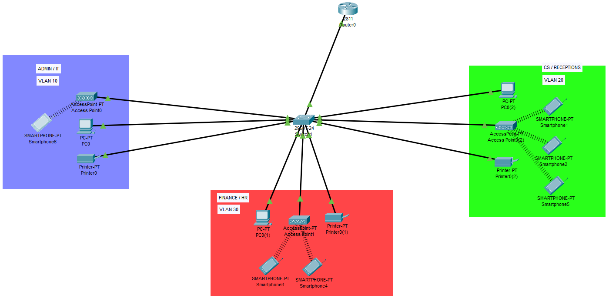
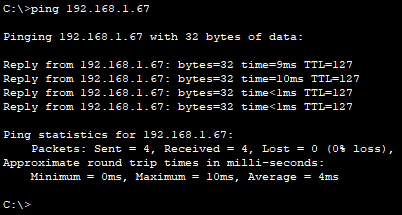
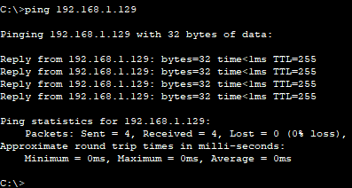
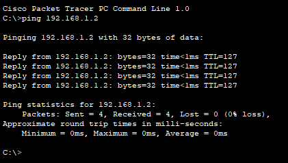
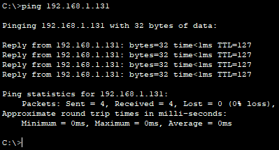
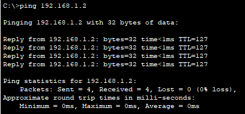
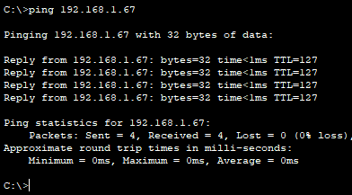

# Design and Simulation of a Simple Network System - Cisco Packet Tracer

## Technologies Implemented

- VLANs
- Inter-VLAN Routing (Router-on-a-Stick)
- DHCP Server
- WLAN / Wireless Network
- Access Point Configuration
- Host Configuration

---

# Devices

| Device | Quantity |
|---------|---------:|
| Router | 1 |
| Switch | 1 |
| PC | 3 |
| Printer | 3 |
| Access Point | 3 |
| Smartphone | 5 |

---

# Topology



---

# Network Addressing

**Base Network:** `192.168.1.0`

**Total Subnets:** `3`

## 1st Subnet

| Item | Value |
|------|------|
| Network ID | 192.168.1.0/26 |
| Broadcast ID | 192.168.1.63 |
| Host Range | 192.168.1.1 – 192.168.1.62 |

---

## 2nd Subnet

| Item | Value |
|------|------|
| Network ID | 192.168.1.64/26 |
| Broadcast ID | 192.168.1.127 |
| Host Range | 192.168.1.65 – 192.168.1.126 |

---

## 3rd Subnet

| Item | Value |
|------|------|
| Network ID | 192.168.1.128/26 |
| Broadcast ID | 192.168.1.191 |
| Host Range | 192.168.1.129 – 192.168.1.190 |

---

# Router Configuration

```bash
Router>en
Router#conf t
Enter configuration commands, one per line. End with CNTL/Z.

Router(config)#int fa0/0
Router(config-if)#no sh

Router(config-if)#
%LINK-5-CHANGED: Interface FastEthernet0/0, changed state to up

%LINEPROTO-5-UPDOWN: Line protocol on Interface FastEthernet0/0, changed state to up

Router(config-if)#exit

Router(config)#int fa0/0.10
Router(config-subif)#
%LINK-5-CHANGED: Interface FastEthernet0/0.10, changed state to up

%LINEPROTO-5-UPDOWN: Line protocol on Interface FastEthernet0/0.10, changed state to up

Router(config-subif)#encapsulation dot1Q 10
Router(config-subif)#ip address 192.168.1.1 255.255.255.192
Router(config-subif)#exit

Router(config)#int fa0/0.20
Router(config-subif)#
%LINK-5-CHANGED: Interface FastEthernet0/0.20, changed state to up

%LINEPROTO-5-UPDOWN: Line protocol on Interface FastEthernet0/0.20, changed state to up

Router(config-subif)#encapsulation dot1Q 20
Router(config-subif)#ip address 192.168.1.65 255.255.255.192
Router(config-subif)#exit

Router(config)#int fa0/0.30
Router(config-subif)#
%LINK-5-CHANGED: Interface FastEthernet0/0.30, changed state to up

%LINEPROTO-5-UPDOWN: Line protocol on Interface FastEthernet0/0.30, changed state to up

Router(config-subif)#encapsulation dot1Q 30
Router(config-subif)#ip address 192.168.1.129 255.255.255.192
Router(config-subif)#exit

Router(config)#service dhcp

Router(config)#ip dhcp pool Admin-pool
Router(dhcp-config)#network 192.168.1.0 255.255.255.192
Router(dhcp-config)#default-router 192.168.1.1
Router(dhcp-config)#dns-server 192.168.1.1
Router(dhcp-config)#exit

Router(config)#ip dhcp pool Customer-Pool
Router(dhcp-config)#network 192.168.1.64 255.255.255.192
Router(dhcp-config)#default-router 192.168.1.65
Router(dhcp-config)#dns-server 192.168.1.65
Router(dhcp-config)#exit

Router(config)#ip dhcp pool Finance-Pool
Router(dhcp-config)#network 192.168.1.128 255.255.255.192
Router(dhcp-config)#default-router 192.168.1.129
Router(dhcp-config)#dns-server 192.168.1.129
Router(dhcp-config)#exit

Router(config)#do wr

Building configuration...
[OK]
```

---

# Switch Configuration

```bash
Switch>en
Switch#conf t
Enter configuration commands, one per line. End with CNTL/Z.

Switch(config)#int range fa0/2-4
Switch(config-if-range)#switchport mode access
Switch(config-if-range)#switchport access vlan 10

% Access VLAN does not exist. Creating vlan 10

Switch(config-if-range)#exit

Switch(config)#vlan 10
Switch(config-vlan)#name Admin

Switch(config-vlan)#vlan 20
Switch(config-vlan)#name CS

Switch(config-vlan)#vlan 30
Switch(config-vlan)#name FINANCE/HR

Switch(config-vlan)#exit

Switch(config)#int range fa0/5-7
Switch(config-if-range)#switchport mode access
Switch(config-if-range)#switchport access vlan 20

Switch(config)#int range fa0/8-10
Switch(config-if-range)#switchport mode access
Switch(config-if-range)#switchport access vlan 30

Switch(config-if-range)#exit

Switch(config)#int fa0/1
Switch(config-if)#switchport mode trunk

Switch(config-if)#do wr

Building configuration...
[OK]
```

---

# Test Connection

| Source | Destination | Result | screenshoot |
|---------|-------------|--------|-------------|
| VLAN 10 | VLAN 20 | ✅ Success |  |
| VLAN 10 | VLAN 30 | ✅ Success |  |
| VLAN 20 | VLAN 10 | ✅ Success |  |
| VLAN 20 | VLAN 30 | ✅ Success |  |
| VLAN 30 | VLAN 10 | ✅ Success |  |
| VLAN 30 | VLAN 20 | ✅ Success |  |

---

# Author

**Adhi Nugroho**